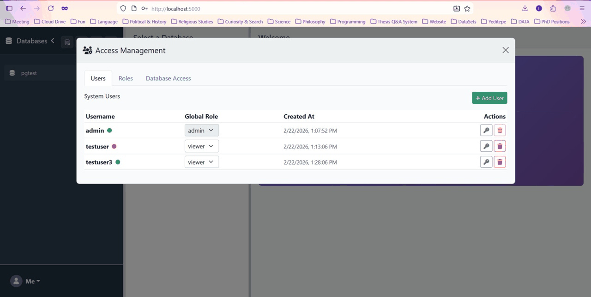

# Database Monitor

A self-hosted Flask web application for monitoring and managing multiple database connections. Features a 3-panel layout with database browser, schema explorer, and SQL editor — all behind multi-user authentication with encrypted credential storage.

| | Status |
|---|---|
| **Tested** | PostgreSQL, MySQL, SQLite, Local Auth |
| **Experimental** | LDAP auth, MS SQL Server, Oracle — implemented but not yet verified in production |

---

## Demo



## Features

**Multi-Database Support**
- PostgreSQL, MySQL, SQLite, MS SQL Server, Oracle
- Add / remove connections from the browser — no config files to edit
- Real-time status monitoring with pulsing green / red indicators (every 5 s)

**Multi-User Authentication & RBAC**
- Local username + password accounts (hashed and salted)
- Optional LDAP / LLDAP backend (direct-bind or search-bind, group filtering) *(experimental)*
- Role-Based Access Control (RBAC) with atomic permissions (`api_access`, `execute_sql_read`, `execute_sql_write`, `execute_sql_ddl`, `manage_users`, `manage_roles`, `manage_connections`)
- Database-specific grants (assign users specific roles on specific databases)
- Per-user connection isolation — each user sees only their own databases unless granted access

**Folder Organization**
- Group related connections into folders (e.g., "Production", "Staging")
- Drag-and-drop support to move connections between folders
- Collapsible folder views to keep the sidebar clean

**Secure Backup & Restore**
- Export all your connections to a password-protected encrypted file (`.enc`)
- Uses industry-standard AES encryption
- Safe to store offline or share (only readable with the password)

**Encrypted Persistence**
- All connection credentials encrypted at rest with AES-128
- Encryption key auto-generated on first run and stored in `data/secret.key`
- User auth stored in a separate `data/auth.db`

**Database Explorer**
- Browse schemas, tables, and views in an expandable tree
- View column details (name, type, nullable) — collapsible by default
- Preview the first 100 rows of any table or view

**SQL Editor**
- Write and execute SQL directly in the browser
- Formatted result tables with column headers
- Supports SELECT, INSERT, UPDATE, DELETE, and DDL

**Resizable Panels**
- Three-panel flexbox layout with a draggable resizer between explorer and editor

---

## Quick Start

### Prerequisites

- Python 3.12+
- [uv](https://docs.astral.sh/uv/) (recommended) or pip

### Install & Run

```bash
git clone https://github.com/erenirmak/db-monitor.git
cd db-monitor

# Using uv (recommended)
uv run python main.py

# Or using pip
pip install -e .
python main.py
```

The app starts at **http://localhost:5000**.

On first launch you'll be redirected to the **Register** page to create your account. After that, log in and start adding database connections from the UI.

### LDAP Support (optional · experimental)

LDAP authentication is implemented but has not been tested against a live directory yet. Feedback and bug reports are welcome.

```bash
# Install the ldap extra
uv add "db-monitor[ldap]"
# or
pip install -e ".[ldap]"
```

Then set `AUTH_MODE=ldap` and the LDAP environment variables below.

### Docker

Sample files are included — rename and run:

```bash
cp Dockerfile.sample Dockerfile
cp docker-compose.yml.sample docker-compose.yml

# Edit docker-compose.yml to set SECRET_KEY and any LDAP vars, then:
docker compose up -d
```

The container stores encryption keys and databases in a named volume (`db-monitor-data`) mounted at `/app/data`, so data survives container restarts.

To enable LDAP auth, uncomment the LDAP environment variables in `docker-compose.yml` and set `AUTH_MODE: "ldap"`. An optional LLDAP service is included (commented out) if you need a lightweight LDAP server.

---

## Configuration

All configuration is done through **environment variables** — no config files to edit.

| Variable | Default | Description |
|---|---|---|
| `SECRET_KEY` | Random on each restart | Flask session secret. Set a fixed value in production. |
| `DB_MONITOR_DATA_DIR` | `./data` | Directory for SQLite databases and the encryption key |
| `SESSION_LIFETIME` | `604800` (7 days) | Session duration in seconds |
| `AUTH_MODE` | `local` | `local` — built-in username/password; `ldap` — LDAP backend |
| `LDAP_URL` | — | LDAP server URL, e.g. `ldap://localhost:3890` |
| `LDAP_BASE_DN` | — | Base DN, e.g. `dc=example,dc=com` |
| `LDAP_USER_DN_TEMPLATE` | — | Direct-bind template, e.g. `uid={username},ou=people,dc=example,dc=com` |
| `LDAP_BIND_DN` | — | Admin DN for search-bind mode |
| `LDAP_BIND_PASSWORD` | — | Admin password for search-bind mode |
| `LDAP_USER_FILTER` | — | Search filter, e.g. `(&(objectClass=person)(uid={username}))` |
| `LDAP_REQUIRE_GROUP` | — | Optional group DN the user must belong to |

---

## Supported Databases

Connections are added via the **Add Connection** modal in the sidebar.

| Engine | Driver / Scheme | Default Port | |
|---|---|---|---|
| PostgreSQL | `postgresql+psycopg://` | 5432 | |
| MySQL | `mysql+pymysql://` | 3306 | |
| MS SQL Server | `mssql+pyodbc://` (ODBC Driver 17) | 1433 | *(experimental)* |
| Oracle | `oracle+cx_oracle://` | 1521 | *(experimental)* |
| SQLite | `sqlite:///` (file path) | — |

> MongoDB, OpenSearch, and Elasticsearch are accepted for status monitoring but don't support the schema explorer or SQL editor (non-SQLAlchemy engines).

Each connection form also has an **Extra JSON** field for advanced driver configuration:

```json
{
  "connect_args": { "sslmode": "require" },
  "pool_pre_ping": true
}
```

`connect_args` is passed to the DBAPI `connect()` call; all other keys go to `create_engine()`.

---

## Usage

### 1. Register & Log In

- First launch → create an account on the **Register** page
- Subsequent visits → sign in on the **Login** page
- Session persists for 7 days by default

### 2. Add a Database

- Click the **+** button in the sidebar
- Fill in the connection form (host, port, username, password, database)
- Click **Test Connection** to verify, then **Save**
- The database appears in the sidebar with a live status indicator

### 3. Explore

- Click a database name to expand its schemas
- Click a schema to see its tables and views
- Click a table to view columns and preview data

### 4. Query

- Click a **schema name** to open the SQL editor for that database
- Write your query and click **Execute** (or Ctrl + Enter)
- Results render in a scrollable table below the editor

### 5. Organize

- Click the **Folder** icon to create a group
- Drag and drop connections into folders to organize them
- Collapse folders to hide less-used connections
- Delete folders (moves items back to root) with the trash icon

### 6. Backup & Restore

- Click your **Username** (top right) → **Secure Backup**
- Enter a password to encrypt your file
- **Restore** using the same password to recover your connections later

### 7. Monitor

- Green pulsing dot = connected
- Red pulsing dot = connection error
- Status refreshes automatically every 5 seconds

---


## API Reference

All API routes require authentication. Unauthenticated requests receive a `401` response.

### Database Management
| Method | Endpoint | Description |
|---|---|---|
| `GET` | `/api/databases` | List current user's databases with status |
| `POST` | `/api/save-connection` | Save a new database connection |
| `POST` | `/api/disconnect/<key>` | Remove a database connection |
| `POST` | `/api/test-connection` | Test a database connection |
| `POST` | `/api/reorder-databases` | Update group and order for a batch of connections |
| `POST` | `/api/delete-folder` | Delete a folder and ungroup its contents |
| `POST` | `/api/connections/export` | Export encrypted connections |
| `POST` | `/api/connections/import` | Import encrypted connections |

### Introspection & Querying
| Method | Endpoint | Description |
|---|---|---|
| `GET` | `/api/database/<key>/schemas` | List schemas in a database |
| `GET` | `/api/database/<key>/schema/<schema>/tables` | List tables and views |
| `GET` | `/api/database/<key>/schema/<schema>/table/<table>` | Column info + first 100 rows |
| `POST` | `/api/database/<key>/execute` | Execute a SQL query (`{"sql": "..."}`) |

### User Management (Admin Only)
| Method | Endpoint | Description |
|---|---|---|
| `GET` | `/api/users` | List all users |
| `POST` | `/api/users` | Create a new user |
| `PUT` | `/api/users/<username>/role` | Update a user's role |
| `PUT` | `/api/users/<username>/password` | Reset a user's password |
| `DELETE` | `/api/users/<username>` | Delete a user |

### Role & Grant Management (Admin Only)
| Method | Endpoint | Description |
|---|---|---|
| `GET` | `/api/roles` | List all roles |
| `POST` | `/api/roles` | Create a new role |
| `DELETE` | `/api/roles/<name>` | Delete a role |
| `GET` | `/api/grants` | List all database grants |
| `POST` | `/api/grants` | Create a new database grant |
| `DELETE` | `/api/grants/<username>/<db_key>` | Delete a database grant |

---

## Security

- **Credentials at rest** — Encrypted with an auto-generated or read from environment secret key
- **Passwords** — Securely hashed and salted
- **Session** — Server-side limited-lifetime sessions
- **Data Isolation** — Users can only access their own connections
- **401 handling** — frontend fetch wrapper auto-redirects to login on session expiry

**Production recommendations:**

1. Set a fixed `SECRET_KEY` environment variable
2. Run behind a reverse proxy with TLS (nginx, Caddy, etc.)
3. Use read-only database credentials where possible
4. Restrict network access to the monitoring port

---

## Dependencies

| Package | Purpose |
|---|---|
| Flask | Web framework |
| SQLAlchemy | Data access |
| cryptography | Encryption |
| psycopg-binary | PostgreSQL driver |
| PyMySQL | MySQL driver |
| ldap3 | LDAP support |

---

## License

MIT — see [LICENSE](LICENSE) for details.
